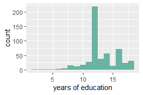

Factors Influencing Marriage
================
2026-03-29

## Marriage

I perform a logistic regression on the CPS1985 data - cross-sectional
data which comes from the May 1985 current population survey by the US
Census Bureau.

<!-- -->

Here we see the distribution of number of years of education, the mean
value being 13.02.

The logit equation used is logit \<- glm(married ~ wage + age +
ethnicity + education + gender, data = df, family = binomial(link =
“logit”)).

First, I predict difference in probability of being married where all
characteristics between two people are the same - set to the mean -
except one person has the mean number of years’ education, and the other
has the highest, at **18 years**. The difference comes out as
**-0.0276.** This implies that going from **13 years** of education to
**18** decreases one’s probability of being married by **-2.76**
percentage points.
