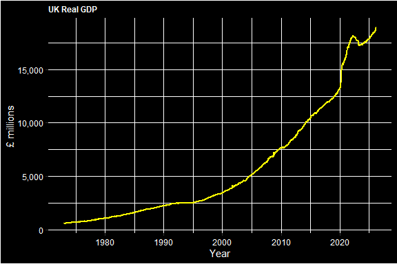
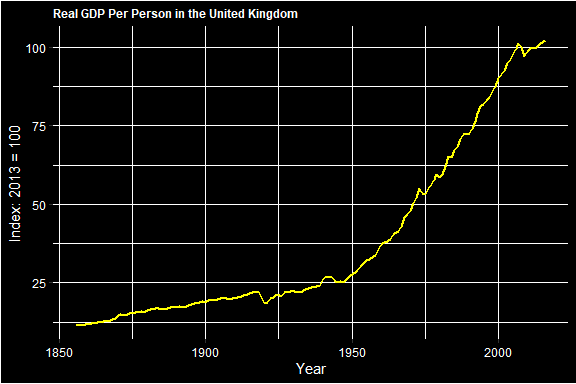
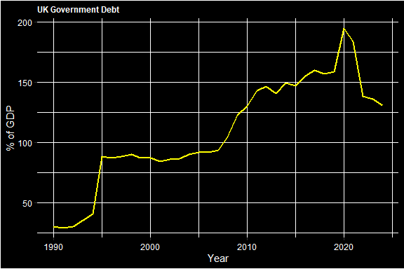
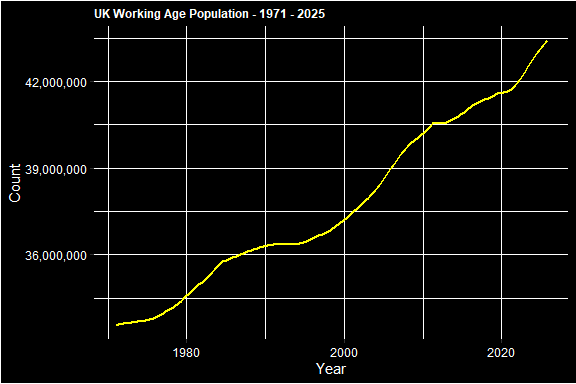

FRED
================
2026-03-30

I recently downloaded a package from
<https://fredblog.stlouisfed.org/2024/12/leveraging-r-for-powerful-data-analysis/>
which lets you download FRED economic data straight into R Studio. I’m
just testing it out here. <!-- -->

The above chart is from
<https://fred.stlouisfed.org/series/NGDPRSAXDCGBQ>.

<!-- -->

The above chart is from <https://fred.stlouisfed.org/series/LPRGDPUKA>.

<!-- -->

The above chart is from
<https://fred.stlouisfed.org/series/DEBTTLGBA188A>.

<!-- -->

The above chart is from
<https://fred.stlouisfed.org/series/LFWA64TTGBQ647S>.
