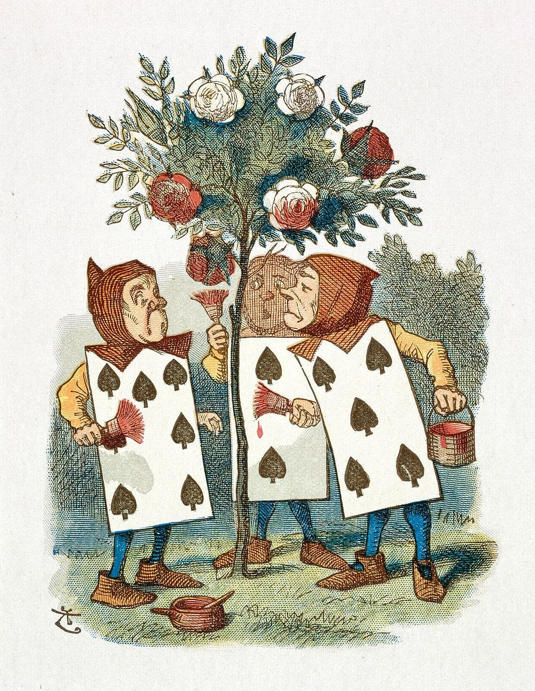

Word ladder
================
2026-03-30

## Word Ladder

Word ladder is a game invented by Lewis Carroll. I prefer the name word
golf, which may or may not have been invented in Nabokov’s Ada or Ardor
(that’s where I first discovered it).

The rules are easy: you get given two words of the same number of
letters - e.g. **PAWS** and **CATS**, and you have to get from one to
the other by changing one letter at a time. Each intermediate word has
to be a real word.

So for the above example, it could be: **PAWS** -\> **PATS** -\>
**CATS**.

What about <strong>KING</strong> → <strong>TOES</strong> in 6 or less?

Reveal answer

<strong>KING</strong> → <strong>KINE</strong> → <strong>SINE</strong> →
<strong>SINS</strong> → <strong>TINS</strong> → <strong>TONS</strong> →
<strong>TOES</strong>

What about <strong>STAR</strong> → <strong>GAZE</strong> in 8 or less?

Reveal answer

<strong>STAR</strong> → <strong>SEAR</strong> → <strong>SEAT</strong> →
<strong>MEAT</strong> → <strong>MELT</strong> → <strong>MALT</strong> →
<strong>MALE</strong> → <strong>GALE</strong> → <strong>GAZE</strong>

<strong>BEAR</strong> → <strong>PAWS</strong> in 6 or less?

Reveal answer

<strong>BEAR</strong> → <strong>BEAT</strong> → <strong>BEST</strong> →
<strong>PEST</strong> → <strong>PAST</strong> → <strong>PASS</strong> →
<strong>PAWS</strong>

<strong>JUMP</strong> → <strong>ROPE</strong> in 6 or less?

Reveal answer

<strong>JUMP</strong> → <strong>DUMP</strong> → <strong>DAMP</strong> →
<strong>DAME</strong> → <strong>DOME</strong> → <strong>DOPE</strong> →
<strong>ROPE</strong>

<strong>KIDS</strong> → <strong>GOAT</strong> in 6 or less?

Reveal answer

<strong>KIDS</strong> → <strong>KISS</strong> → <strong>MISS</strong> →
<strong>MOSS</strong> → <strong>MOST</strong> → <strong>MOAT</strong> →
<strong>GOAT</strong>

<strong>GLASS</strong> → <strong>PINTS</strong> in 14 or less?

Reveal answer

<strong>GLASS</strong> → <strong>GRASS</strong> → <strong>BRASS</strong>
→ <strong>BRATS</strong> → <strong>BEATS</strong> →
<strong>SEATS</strong> → <strong>SEARS</strong> → <strong>SEALS</strong>
→ <strong>SELLS</strong> → <strong>BELLS</strong> →
<strong>BILLS</strong> → <strong>TILLS</strong> → <strong>TILTS</strong>
→ <strong>TINTS</strong> → <strong>PINTS</strong>

<strong>LION</strong> → <strong>ROAR</strong> in 8 or less?

Reveal answer

<strong>LION</strong> → <strong>LOON</strong> → <strong>LOOP</strong> →
<strong>COOP</strong> → <strong>COUP</strong> → <strong>SOUP</strong> →
<strong>SOAP</strong> → <strong>SOAR</strong> → <strong>ROAR</strong>

<strong>HARE</strong> → <strong>BELL</strong> in 4 or less?

Reveal answer

<strong>HARE</strong> → <strong>HALE</strong> → <strong>BALE</strong> →
<strong>BALL</strong> → <strong>BELL</strong>

<strong>HAIR</strong> → <strong>MANE</strong> in 4 or less?

Reveal answer

<strong>HAIR</strong> → <strong>HAIL</strong> → <strong>HALL</strong> →
<strong>HALE</strong> → <strong>MALE</strong>

<strong>FLOUR</strong> → <strong>BREAD</strong> in 13 or less?

Reveal answer

<strong>FLOUR</strong> → <strong>FLOUT</strong> → <strong>FLOAT</strong>
→ <strong>GLOAT</strong> → <strong>BLOAT</strong> →
<strong>BLEAT</strong> → <strong>PLEAT</strong> → <strong>PLEAS</strong>
→ <strong>FLEAS</strong> → <strong>FLEES</strong> →
<strong>FREES</strong> → <strong>FREED</strong> → <strong>BREED</strong>
→ <strong>BREAD</strong>

<strong>KEYS</strong> → <strong>LOCK</strong> in 7 or less?

Reveal answer

<strong>KEYS</strong> → <strong>KEGS</strong> → <strong>BEGS</strong> →
<strong>BOGS</strong> → <strong>BOOS</strong> → <strong>BOOK</strong> →
<strong>LOOK</strong> → <strong>LOCK</strong>

