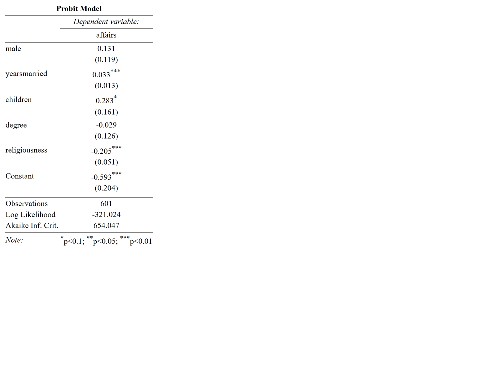
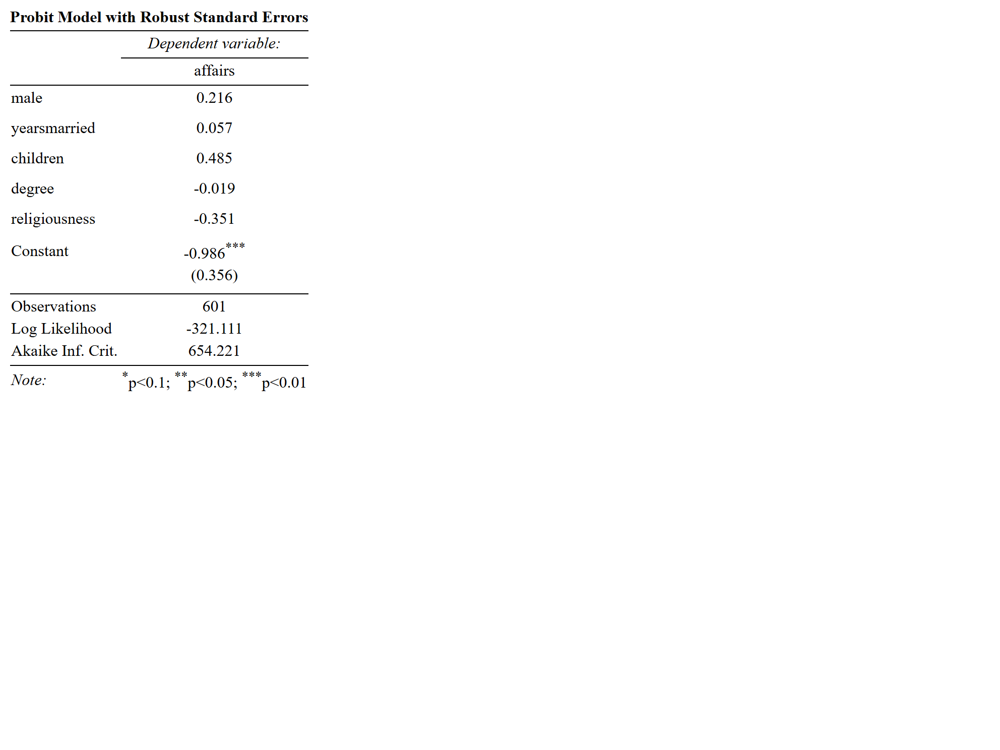

```{r setup, include=FALSE}
knitr::opts_chunk$set(echo = TRUE)
library(here)
library(dplyr)
library(AER)
library(plm)
library(lmtest)
library(tidyr)
library(sandwich)
library(stargazer)
```

## What causes people to have affairs?

I use the Affairs package from AER to investigate what causes people to be infidelitous. The data is cross-sectional data from a survey conducted by Psychology Today in 1969. 

I perform a probit and logit regression of whether someone had an affair (affair>0), on various independent variables. 


```{r datafind, include = FALSE}
source(here::here("afffair.R"))
```

The regression equation I estimate is affairs ~ male + yearsmarried + children + degree + religiousness, where degree is a dummy variable equal to 1 when one's educational attainment is college degree or higher. Religiousness is ranked on a scale of 1-5, with one being anti-religious, and 5 being ardently religious. 

I use probit and logit, then estimate the regression, performing t-tests with robust-to-heteroskedasticity standard errors. 

## Probit

```{r, out.width="80%", fig.align="center", echo = FALSE}

```

## Logit 

```{r, out.width="80%", fig.align="center", echo = FALSE}

```