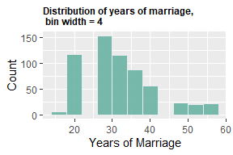
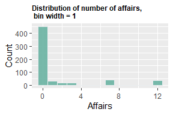

Affairs
================
2026-03-28

## What causes people to have affairs?

I use the Affairs package from AER to investigate what causes people to
be infidelitous. The data is cross-sectional data from a survey
conducted by Psychology Today in 1969.

I perform a probit and logit regression of whether someone had an affair
(affair\>0), on various independent variables.

## Data Inspection

    ##     affairs          gender         age         yearsmarried    children 
    ##  Min.   : 0.000   female:315   Min.   :17.50   Min.   : 0.125   no :171  
    ##  1st Qu.: 0.000   male  :286   1st Qu.:27.00   1st Qu.: 4.000   yes:430  
    ##  Median : 0.000                Median :32.00   Median : 7.000            
    ##  Mean   : 1.456                Mean   :32.49   Mean   : 8.178            
    ##  3rd Qu.: 0.000                3rd Qu.:37.00   3rd Qu.:15.000            
    ##  Max.   :12.000                Max.   :57.00   Max.   :15.000            
    ##  religiousness     education       occupation        rating     
    ##  Min.   :1.000   Min.   : 9.00   Min.   :1.000   Min.   :1.000  
    ##  1st Qu.:2.000   1st Qu.:14.00   1st Qu.:3.000   1st Qu.:3.000  
    ##  Median :3.000   Median :16.00   Median :5.000   Median :4.000  
    ##  Mean   :3.116   Mean   :16.17   Mean   :4.195   Mean   :3.932  
    ##  3rd Qu.:4.000   3rd Qu.:18.00   3rd Qu.:6.000   3rd Qu.:5.000  
    ##  Max.   :5.000   Max.   :20.00   Max.   :7.000   Max.   :5.000

<!-- -->

<!-- --> The regression
equation I estimate is affairs ~ male + yearsmarried + children +
degree + religiousness, where degree is a dummy variable equal to 1 when
one’s educational attainment is college degree or higher. Religiousness
is ranked on a scale of 1-5, with one being anti-religious, and 5 being
ardently religious.

I use probit and logit, then estimate the regression, performing t-tests
with robust-to-heteroskedasticity standard errors.

## Regression Outputs

For the both models, the coefficients yearsmarried, religiousness and
children are statistically significant at the 10% level or below. I’ll
just focus on the probit one to save space.

## Explanation

The coefficient on yearsmarried is **0.033**. On its own, this doesn’t
tell us much as it can’t be used to make linear predictions like in OLS.
To get an understanding on what it means, one must use differences. I
predicted the probability of having an affair for two different people,
who have identical values of variables except one has been married for 1
year, the other for 10. Then I computed the difference in probabilities
of having an affair for these two people.

The difference between 10 years’ marriage and 1 years’ marriage is
**0.0867, which means that - all else equal - someone with 10 years’**
marriage is **8.67** percentage points more likely to have an affair
than someone with 1 years’ of marriage.

**Children** has a large effect. With a coefficient of **0.283** again
not being very informative, I do a difference in predictions experiment.
With all variables being kept at their means, except children where one
person has none, and the other has children, having children increases
the probability of having an affair by **8.35** percentage points.

Finally **religiosity** has a strong effect, with a coefficient of
**-0.205**. Doing a difference experiment shows that going from being
anti-religious to ardently religious decreases the probability of having
an affair by **-25.46**
