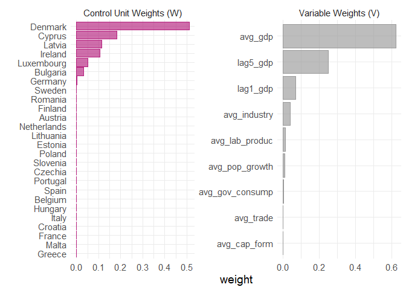
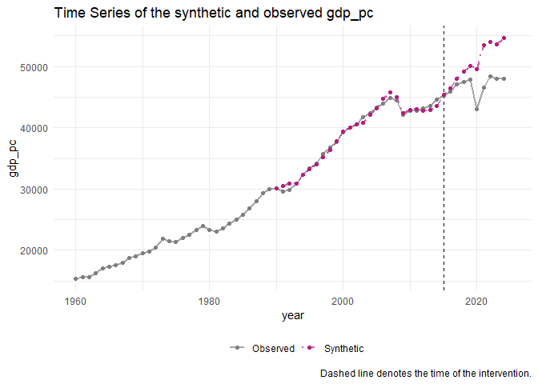
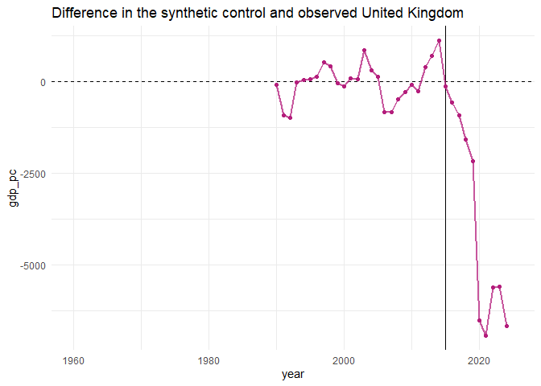
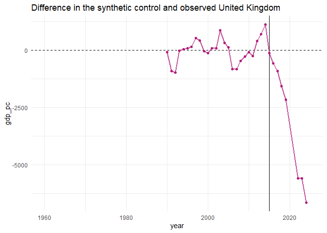

BREXIT - Synthetic Controls
================
2026-04-06

# Introduction

BREXIT synthetic control analysis.

## Synthetic UK after 2016 referendum

## Control and variable weights

<!-- -->

It looks like Ukraine was the most suitable in constructing a synthetic
Romania pre-2007. Turkey, Indonesia and South Korea also contribute a
lot. The variable given the most weight is average gdp per capita.

## Synthetic and treated comparison

    ## # A tibble: 9 × 4
    ##   variable        `United Kingdom` `synthetic_United Kingdom` donor_sample
    ##   <chr>                      <dbl>                      <dbl>        <dbl>
    ## 1 avg_cap_form              18.4                       21.9         23.1  
    ## 2 avg_gdp                39419.                     39427.       26260.   
    ## 3 avg_gov_consump           18.9                       21.4         19.9  
    ## 4 avg_industry              21.6                       21.6         24.9  
    ## 5 avg_lab_produc         92492.                    102079.       91413.   
    ## 6 avg_pop_growth             0.513                      0.565        0.201
    ## 7 avg_trade                 53.5                      110.         101.   
    ## 8 lag5_gdp               43693.                     43407.       29875.   
    ## 9 lag1_gdp               45255.                     45382.       31005.

The algorithm’s done a good job - mostly - in creating a synthetic
Romania. Average GDP, imports and average government consumption, are
especially similar. The only major flaw is that real Romania has
negative population growth, which the synthetic doesn’t.

<!-- -->

There is a clear jump in real GDP per capita for Romania after accession
to the EU compared to the synthetic.

<!-- -->

This can also be seen by plotting the differences. Before the accession,
the difference moved around a mean of 0. After, the gap fairly
consistently grows.

# Excluding COVID Years

I also try excluding 2020 and 2021 in case COVID was messing with the
inference.

    ## # A tibble: 9 × 4
    ##   variable        `United Kingdom` `synthetic_United Kingdom` donor_sample
    ##   <chr>                      <dbl>                      <dbl>        <dbl>
    ## 1 avg_cap_form              18.4                       21.9         23.1  
    ## 2 avg_gdp                39419.                     39427.       26260.   
    ## 3 avg_gov_consump           18.9                       21.4         19.9  
    ## 4 avg_industry              21.6                       21.6         24.9  
    ## 5 avg_lab_produc         92492.                    102079.       91413.   
    ## 6 avg_pop_growth             0.513                      0.565        0.201
    ## 7 avg_trade                 53.5                      110.         101.   
    ## 8 lag5_gdp               43693.                     43407.       29875.   
    ## 9 lag1_gdp               45255.                     45382.       31005.

<!-- -->

<!-- -->
