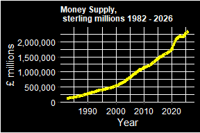
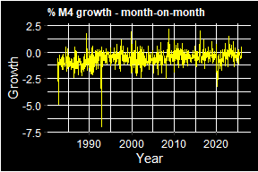
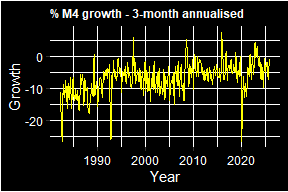
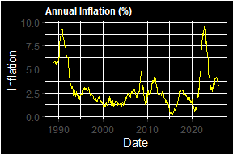

Money Supply
================
2026-03-29

## Money Supply

Using data from <https://www.bankofengland.co.uk/statistics/Tables>,
Table A2.2.1 - Components of M4, I plot the change in UK money supply.
Since most of the money supply is created when commerical banks create
deposits, I use total retail deposits for households and private
non-financial corporations. Wholesale deposits and repos are excluded,
as well as notes and coin.

The data runs from 1982-06-01 to 2026-01-01. I plot total money supply
in sterling millions, month-on-month % growth rate as well as 3-month
annualised growth rate.

<!-- -->

The money supply as of 2026-01-01 is £2,358,688,000,000, i.e. £2
trillion.

For month-on-month growth rates, the highest growth occurred on
2008-09-01, with a growth rate of 2.19%.

For 3-month annualised growth rates, the highest growth occurred on
2015-12-01, with a growth rate of 7.8%.

## Inflation

I plot annualised inflation data from
<https://www.ons.gov.uk/economy/inflationandpriceindices/timeseries/l55o/mm23>.

<!-- -->

Between 1989-01-01 and 2026-02-01, the highest recorded rate of
inflation was **9.6%** which occurred in 2022-10-01
