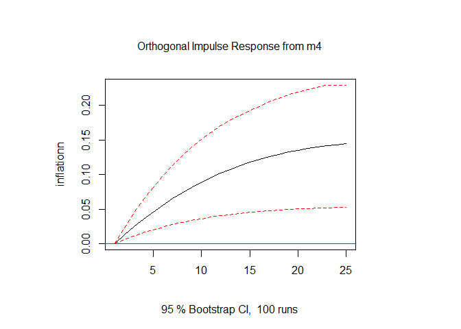

Money Supply
================
2026-03-29

# Money Supply

I want to see whether year-on-year money supply growth affects
year-on-year inflation.

Using data from <https://www.bankofengland.co.uk/statistics/Tables>,
Table A2.2.1 - Components of M4, I plot the change in UK money supply.
Since most of the money supply is created when commerical banks create
deposits, I use total retail deposits for households and private
non-financial corporations. Wholesale deposits and repos are excluded,
as well as notes and coin.

The data runs from 1982-06-01 to 2026-01-01. I plot total money supply
in sterling millions and year-on-year money supply growth.

<!-- -->

The money supply as of 2026-01-01 is £2,358,688,000,000, i.e. £2
trillion.


For year on year growth rates, the highest growth occurred on
1983-06-01, with a growth rate of **17.93%**.

## Inflation

I plot year on year inflation data from
<https://www.ons.gov.uk/economy/inflationandpriceindices/timeseries/l55o/mm23>.
Compare it to money supply growth.

<!-- -->

Between 1989-01-01 and 2026-01-01, the highest recorded rate of
inflation was **9.6%** which occurred in 2022-10-01

## VAR Model

I run a VAR model on the data. I first did a simple dynlm but wasn’t
happy with the results. The benefit of VAR is that all variables are
endogenous, so money growth is allowed to affect inflation and
vice-versa. This is probably more realistic since inflation can cause
money growth movements via central bank behaviour, and money supply
growth can affect inflation behaviour too.

``` r
var_data <- ts(var_data, start = start(inf$inflation), frequency = 12)
lagselect <- VARselect(var_data, lag.max = 12, type = "const")
lagselect
```

    ## $selection
    ## AIC(n)  HQ(n)  SC(n) FPE(n) 
    ##     12      5      1     12 
    ## 
    ## $criteria
    ##                 1          2          3           4           5           6
    ## AIC(n) -2.8145418 -2.8406452 -2.8584032 -2.90078580 -2.93345657 -2.91955900
    ## HQ(n)  -2.7922744 -2.8035330 -2.8064461 -2.83398376 -2.85180963 -2.82306716
    ## SC(n)  -2.7581343 -2.7466328 -2.7267858 -2.73156345 -2.72662925 -2.67512672
    ## FPE(n)  0.0599322  0.0583881  0.0573606  0.05498066  0.05321395  0.05395943
    ##                  7           8           9          10          11          12
    ## AIC(n) -2.93446595 -2.92358742 -2.90920797 -2.91388469 -2.92764157 -2.93835042
    ## HQ(n)  -2.82312921 -2.79740578 -2.76818143 -2.75801326 -2.75692524 -2.75278919
    ## SC(n)  -2.65242869 -2.60394520 -2.55196078 -2.51903254 -2.49518445 -2.46828833
    ## FPE(n)  0.05316205  0.05374489  0.05452504  0.05427278  0.05353383  0.05296662

BIC (also known as Schwarz criterion) says to use 1 lag(s).

``` r
var_model <- VAR(var_data, p = lagselect$selection["SC(n)"], type = "const")
summary(var_model)
```

    ## 
    ## VAR Estimation Results:
    ## ========================= 
    ## Endogenous variables: inflationn, m4 
    ## Deterministic variables: const 
    ## Sample size: 444 
    ## Log Likelihood: -632.073 
    ## Roots of the characteristic polynomial:
    ## 0.9703 0.9703
    ## Call:
    ## VAR(y = var_data, p = lagselect$selection["SC(n)"], type = "const")
    ## 
    ## 
    ## Estimation results for equation inflationn: 
    ## =========================================== 
    ## inflationn = inflationn.l1 + m4.l1 + const 
    ## 
    ##                Estimate Std. Error t value Pr(>|t|)    
    ## inflationn.l1  0.986702   0.006920 142.579  < 2e-16 ***
    ## m4.l1          0.015113   0.004449   3.397 0.000744 ***
    ## const         -0.066087   0.037908  -1.743 0.081969 .  
    ## ---
    ## Signif. codes:  0 '***' 0.001 '**' 0.01 '*' 0.05 '.' 0.1 ' ' 1
    ## 
    ## 
    ## Residual standard error: 0.2931 on 441 degrees of freedom
    ## Multiple R-Squared: 0.9788,  Adjusted R-squared: 0.9787 
    ## F-statistic: 1.018e+04 on 2 and 441 DF,  p-value: < 2.2e-16 
    ## 
    ## 
    ## Estimation results for equation m4: 
    ## =================================== 
    ## m4 = inflationn.l1 + m4.l1 + const 
    ## 
    ##               Estimate Std. Error t value Pr(>|t|)    
    ## inflationn.l1 -0.04963    0.01972  -2.517 0.012206 *  
    ## m4.l1          0.95338    0.01268  75.191  < 2e-16 ***
    ## const          0.42039    0.10803   3.891 0.000115 ***
    ## ---
    ## Signif. codes:  0 '***' 0.001 '**' 0.01 '*' 0.05 '.' 0.1 ' ' 1
    ## 
    ## 
    ## Residual standard error: 0.8352 on 441 degrees of freedom
    ## Multiple R-Squared: 0.9277,  Adjusted R-squared: 0.9274 
    ## F-statistic:  2829 on 2 and 441 DF,  p-value: < 2.2e-16 
    ## 
    ## 
    ## 
    ## Covariance matrix of residuals:
    ##            inflationn        m4
    ## inflationn   0.085891 -0.003499
    ## m4          -0.003499  0.697578
    ## 
    ## Correlation matrix of residuals:
    ##            inflationn       m4
    ## inflationn    1.00000 -0.01429
    ## m4           -0.01429  1.00000

With a coefficient of **0.015**, significant at the 5% level, we see
that lagged M4 growth positively affects inflation. For example, the
mean M4 growth value of **7%** would increase inflation by **0.112**
percentage points. The maximum M4 growth of **18%** would raise
inflation by **0.271** percentage points.

With a coefficient of **0.99** we also see that inflation is extremely
dependent on lagged inflation, and therefore very persistent.

Similarly, lagged inflation affects M4 growth with a coefficient of
-0.05. So mean inflation growth of **2%** would decrease M4 growth by
**-0.14** percentage points. This captures monetary tightening by the
Bank of England following an inflation spike.

## Impulse response

Finally I plot an impulse-response function. This shows how inflation
responds to a 1 S.D. shock to M4 growth, over a 24 month period.

``` r
irf_model <- irf(var_model, impulse = "m4", response = "inflationn",
                 n.ahead = 24, boot = TRUE)
plot(irf_model)
```

<!-- -->
