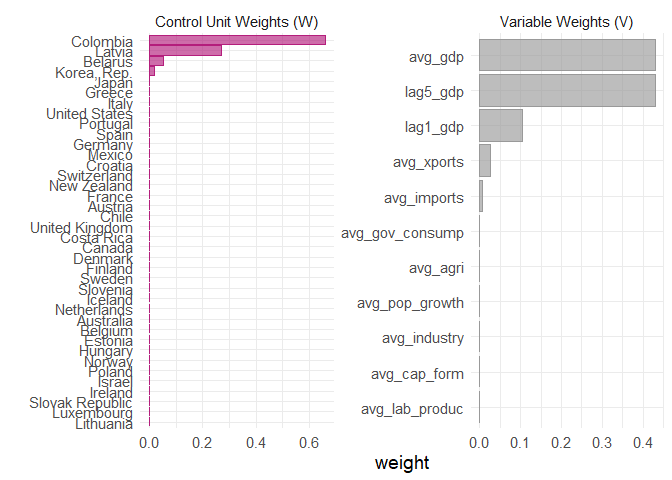
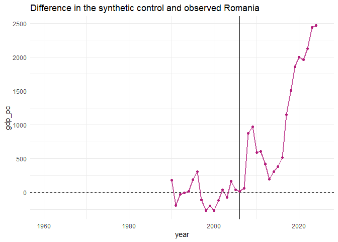

Romania
================
2026-04-05

``` r
source(here::here("Barbara","romania_synthetic.R"))
```

    ## Warning: package 'AER' was built under R version 4.4.1

    ## Loading required package: car

    ## Loading required package: carData

    ## Loading required package: lmtest

    ## Loading required package: zoo

    ## 
    ## Attaching package: 'zoo'

    ## The following objects are masked from 'package:base':
    ## 
    ##     as.Date, as.Date.numeric

    ## Loading required package: sandwich

    ## Loading required package: survival

    ## Warning: package 'patchwork' was built under R version 4.4.3

    ## Warning: package 'ggplot2' was built under R version 4.4.3

    ## Warning: package 'tibble' was built under R version 4.4.3

    ## Warning: package 'purrr' was built under R version 4.4.3

    ## Warning: package 'dplyr' was built under R version 4.4.3

    ## ── Attaching core tidyverse packages ──────────────────────── tidyverse 2.0.0 ──
    ## ✔ dplyr     1.2.0     ✔ readr     2.1.5
    ## ✔ forcats   1.0.0     ✔ stringr   1.5.1
    ## ✔ ggplot2   4.0.2     ✔ tibble    3.3.1
    ## ✔ lubridate 1.9.3     ✔ tidyr     1.3.1
    ## ✔ purrr     1.2.1

    ## ── Conflicts ────────────────────────────────────────── tidyverse_conflicts() ──
    ## ✖ dplyr::filter() masks stats::filter()
    ## ✖ dplyr::lag()    masks stats::lag()
    ## ✖ dplyr::recode() masks car::recode()
    ## ✖ purrr::some()   masks car::some()
    ## ℹ Use the conflicted package (<http://conflicted.r-lib.org/>) to force all conflicts to become errors

    ## Warning: package 'MatchIt' was built under R version 4.4.3

    ## Warning: package 'cobalt' was built under R version 4.4.3

    ##  cobalt (Version 4.6.2, Build Date: 2026-01-29)
    ## 
    ## Attaching package: 'cobalt'
    ## 
    ## The following object is masked from 'package:MatchIt':
    ## 
    ##     lalonde

    ## Warning: package 'matrixStats' was built under R version 4.4.3

    ## 
    ## Attaching package: 'matrixStats'
    ## 
    ## The following object is masked from 'package:dplyr':
    ## 
    ##     count

    ## Warning: package 'ivreg' was built under R version 4.4.3

    ## Registered S3 methods overwritten by 'ivreg':
    ##   method              from
    ##   anova.ivreg         AER 
    ##   hatvalues.ivreg     AER 
    ##   model.matrix.ivreg  AER 
    ##   predict.ivreg       AER 
    ##   print.ivreg         AER 
    ##   print.summary.ivreg AER 
    ##   summary.ivreg       AER 
    ##   terms.ivreg         AER 
    ##   update.ivreg        AER 
    ##   vcov.ivreg          AER 
    ## 
    ## Attaching package: 'ivreg'
    ## 
    ## The following objects are masked from 'package:AER':
    ## 
    ##     ivreg, ivreg.fit

    ## Warning: package 'rdrobust' was built under R version 4.4.3

    ## Warning: package 'estimatr' was built under R version 4.4.3

    ## Warning: package 'Synth' was built under R version 4.4.3

    ## ##
    ## ## Synth Package: Implements Synthetic Control Methods.
    ## 
    ## ## See https://web.stanford.edu/~jhain/synthpage.html for additional information.

    ## Warning: package 'tidysynth' was built under R version 4.4.3

    ## Warning: package 'jtools' was built under R version 4.4.3

    ## Warning: Using `size` aesthetic for lines was deprecated in ggplot2 3.4.0.
    ## ℹ Please use `linewidth` instead.
    ## ℹ The deprecated feature was likely used in the tidysynth package.
    ##   Please report the issue to the authors.
    ## This warning is displayed once per session.
    ## Call `lifecycle::last_lifecycle_warnings()` to see where this warning was
    ## generated.

    ## Saving 7 x 5 in image

    ## Warning: Removed 1 row containing missing values or values outside the scale range
    ## (`geom_line()`).

    ## Warning: Removed 1 row containing missing values or values outside the scale range
    ## (`geom_line()`).
    ## Removed 1 row containing missing values or values outside the scale range
    ## (`geom_line()`).
    ## Removed 1 row containing missing values or values outside the scale range
    ## (`geom_line()`).

``` r
library(AER)
library(patchwork)
library(tidyverse)
library(dplyr)
library(purrr)
library(readr)
library("MatchIt")
library("cobalt")
library("matrixStats")
library(ivreg)
library("rdrobust")
library("estimatr")
library("Synth") 
library("tidysynth")  
library("jtools")
library(tidyr)
library(dplyr)
library(tidyr)
library(purrr)
library(readr)
library(tidysynth)
```

## Synthetic romania after joining EU

``` r
# Weighting of units and variables
gdp_out %>% plot_weights()
```

<!-- -->

``` r
# Comparability of synthetic control to treated unit
gdp_out %>% grab_balance_table()
```

    ## # A tibble: 11 × 4
    ##    variable          Romania synthetic_Romania donor_sample
    ##    <chr>               <dbl>             <dbl>        <dbl>
    ##  1 avg_agri           14.7               9.72         3.79 
    ##  2 avg_cap_form       23.6              22.9         23.9  
    ##  3 avg_gdp          4938.             4967.       27776.   
    ##  4 avg_gov_consump    14.4              17.6         18.8  
    ##  5 avg_imports        31.2              30.5         38.8  
    ##  6 avg_industry       35.3              28.1         26.7  
    ##  7 avg_lab_produc  42098.            30843.       83677.   
    ##  8 avg_pop_growth     -0.566             0.819        0.555
    ##  9 avg_xports         24.4              25.0         38.8  
    ## 10 lag5_gdp         5974.             5936.       31589.   
    ## 11 lag1_gdp         6877.             6859.       33350.

``` r
#graph comparing paths
gdp_out %>% plot_trends()
```

    ## Warning: Removed 62 rows containing missing values or values outside the scale range
    ## (`geom_line()`).

    ## Warning: Removed 62 rows containing missing values or values outside the scale range
    ## (`geom_point()`).

<!-- -->

``` r
# Graph of difference between the two
gdp_out %>% plot_differences()
```

    ## Ignoring unknown labels:
    ## • colour : ""
    ## • linetype : ""

    ## Warning: Removed 31 rows containing missing values or values outside the scale range
    ## (`geom_line()`).

    ## Warning: Removed 31 rows containing missing values or values outside the scale range
    ## (`geom_point()`).

<!-- -->
