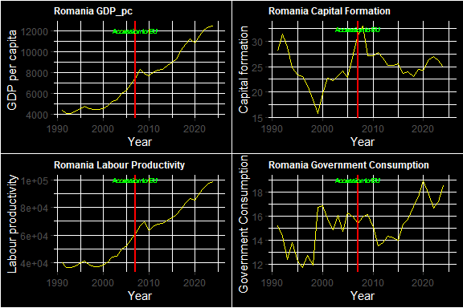
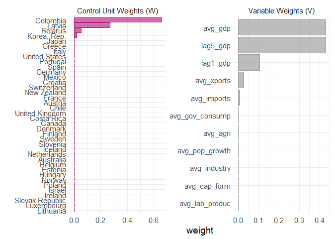
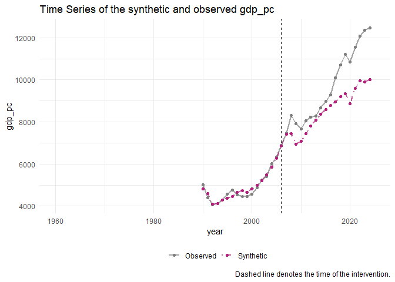
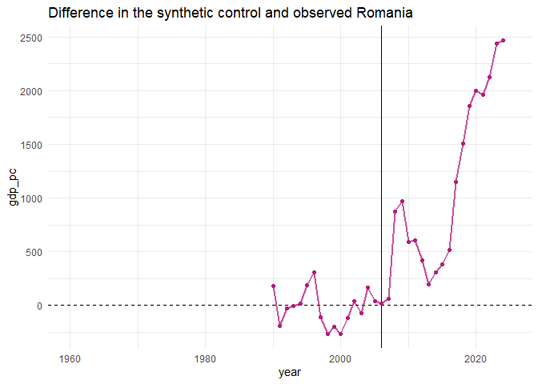

Romania - Synthetic Controls
================
2026-04-05

# Introduction

I recently learned how to do synthetic control estimation of causal
effects in R. This is me just testing the code and getting used to how
it works. The effect to be tested is the effect of Romania joining the
EU in 2007 on real GDP per capita.

## Synthetic Romania after joining EU

I use 11 predictor variables in the function to explain GDP per capita.
See the synthetic and treated comparison table below for a list. On
account of NAs, I had to reduce the data to 1991 - 2021.

## A few summary plots

<!-- -->

## Control and variable weights

<!-- -->

It looks like Colombia was the most suitable in constructing a synthetic
Romania pre-2007. Latvia, Belarus and South (I presume) Korea also
contribute a bit.

## Synthetic and treated comparison

    ## # A tibble: 11 × 4
    ##    variable          Romania synthetic_Romania donor_sample
    ##    <chr>               <dbl>             <dbl>        <dbl>
    ##  1 avg_agri           14.7               9.72         3.79 
    ##  2 avg_cap_form       23.6              22.9         23.9  
    ##  3 avg_gdp          4938.             4967.       27776.   
    ##  4 avg_gov_consump    14.4              17.6         18.8  
    ##  5 avg_imports        31.2              30.5         38.8  
    ##  6 avg_industry       35.3              28.1         26.7  
    ##  7 avg_lab_produc  42098.            30843.       83677.   
    ##  8 avg_pop_growth     -0.566             0.819        0.555
    ##  9 avg_xports         24.4              25.0         38.8  
    ## 10 lag5_gdp         5974.             5936.       31589.   
    ## 11 lag1_gdp         6877.             6859.       33350.

The algorithm’s done a good job - mostly - in creating a synthetic
Romania. Average GDP, exports and imports are especially similar. The
only major flaw is that real Romania has negative population growth,
which the synthetic doesn’t.

<!-- -->

There is a clear jump in real GDP per capita for Romania after accession
to the EU compared to the synthetic.

<!-- -->

This can also be seen by plotting the differences. Before the accession,
the difference moved around a mean of 0. After, it only grows.
